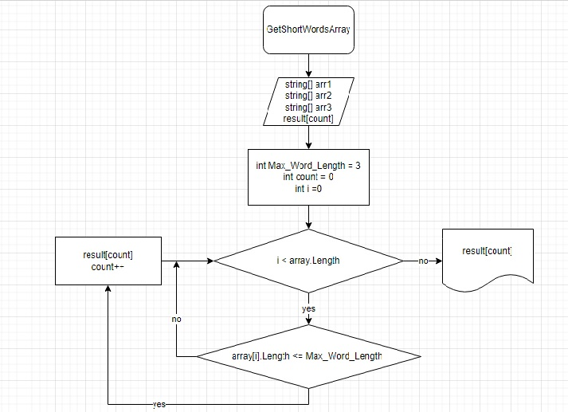

## Задача:
 Написать программу, которая из имеющегося массива строк формирует новый массив из строк, длина которых меньше, либо равна 3 символам. Первоначальный массив можно ввести с клавиатуры, либо задать на старте выполнения алгоритма. При решении не рекомендуется пользоваться коллекциями, лучше обойтись исключительно массивами.
 ## Блок схема
 

 ## Описание решения задачи

 ## 1.
 Нам даны три исходных строковых массива :
* string[] arr1 = {"Hello" , "2" , "world" , ":-)"};

* string[] arr2 = {"1234" , "1567" , "-2" ,"computer science"};
* string[] arr3 = {"Russia" , "Denmark" , "Kazan"};
## 2. 
Заводим максимально допустимое значение символов в слове :

**Max_Word_Length = 3**

## 3.
Заводим значение **count** ,эта переменная ,которая будет считать элементы массива , удовлетворяющие условиям задачи.

## 4.

**result[count]** пустой массив в который мы в последствии будем помещать подходящие значения под наши условия

## 5.
Проходимся по всем значениям заданных массивов.

Значения массивов, которые не соответствуют условию **<= Max_Word_Length** мы пропускаем, а которые соответствуют помещаем в новый массив **result[count]**
 
## 6.
Распечатываем новый заполненный массив
 